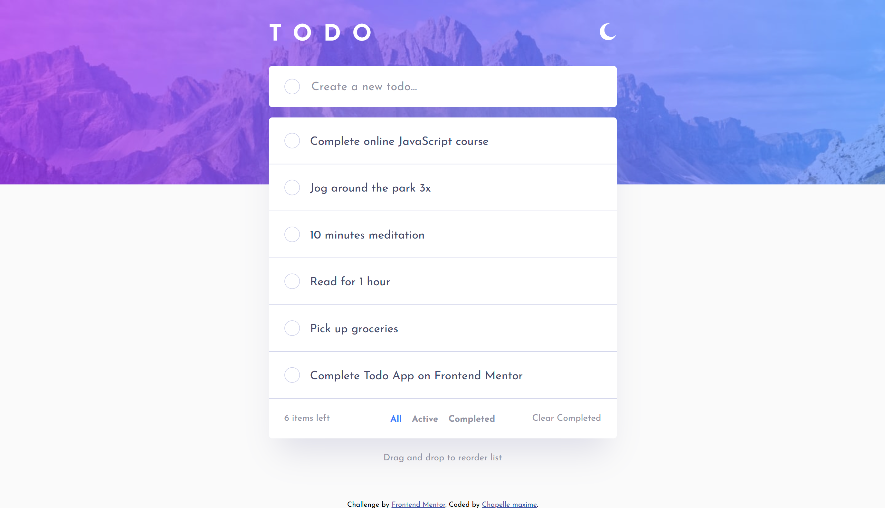
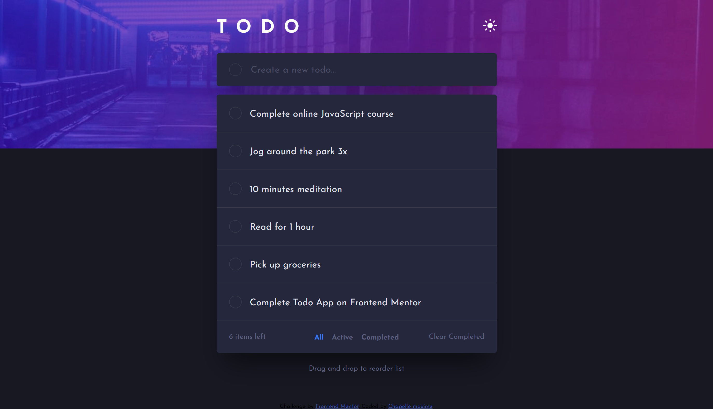

# Frontend Mentor - Todo app solution

This is a solution to the [Todo app challenge on Frontend Mentor](https://www.frontendmentor.io/challenges/todo-app-Su1_KokOW). Frontend Mentor challenges help you improve your coding skills by building realistic projects.

## Table of contents

- [Overview](#overview)
  - [The challenge](#the-challenge)
  - [Screenshot](#screenshot)
  - [Links](#links)
- [My process](#my-process)
  - [Built with](#built-with)
  - [What I learned](#what-i-learned)
  - [Continued development](#continued-development)
- [Author](#author)

## Overview

### The challenge

Users should be able to:

- View the optimal layout for the app depending on their device's screen size
- See hover states for all interactive elements on the page
- Add new todos to the list
- Mark todos as complete
- Delete todos from the list
- Filter by all/active/complete todos
- Clear all completed todos
- Toggle light and dark mode
- **Bonus**: Drag and drop to reorder items on the list

### Screenshot

### Links

- Solution URL: [Add solution URL here](https://your-solution-url.com)
- Live Site URL: [Live site on GitHub Pages](https://maxi1993-tech.github.io/Todo-app/)

## My process

### Built with

- Semantic HTML5 markup
- CSS custom properties
- Flexbox
- Sass (7-1 architecture)
- BEM naming convention
- Mobile-first workflow
- Vanilla JavaScript (ES6+)
- Web Storage API (localStorage)
- HTML Drag and Drop API
- `<template>` element and `cloneNode()`
- Accessibility: ARIA labels, live regions, `:focus-visible`

### What I learned

**Theming.** I thought a dark theme was built with a media query. I found out that `prefers-color-scheme` answers a different question: it reads the system preference, it does not react to a button. The pattern I learned relies on a single set of variables with two sets of values, `:root` for the light theme and `[data-theme="dark"]` for the dark one, with the attribute set on `<html>`. Components only read custom properties: none of them holds a hard-coded colour or knows which theme is active. Adding a third theme would require no change to any component.

**localStorage.** localStorage only stores strings: `JSON.stringify` on write, `JSON.parse` on read. I went for two separate keys, one for the theme and one for the todos, rather than a single object: the two have no reason to be coupled. This is also when I replaced my incrementing id counter with `crypto.randomUUID()`. A counter resets to zero on page reload, so it collides with the ids restored from storage, and both `find` and `findIndex` always return the first match.

**Drag and drop.** This one required understanding the whole mechanics of the native HTML5 API. The part that held me up the longest: the browser rejects the drop by default, so `event.preventDefault()` has to be called in `dragover` for the `drop` event to fire at all. The MDN example moves DOM elements directly with `appendChild`, which could not work here: my DOM mirrors the todos array, so any direct move would be wiped on the next render. I reorder the array with two `splice` calls instead, then re-render. Known and accepted limitation: the native API does not respond to touch, and there is no keyboard alternative to reordering.

### Continued development

Three things I want to come back to on this project.

**A keyboard alternative to reordering.** Drag and drop relies on the native HTML5 API, which offers no keyboard equivalent. Anyone navigating without a mouse cannot reorder their todos at all. This is the clearest accessibility gap left.

**Refactoring `loadTheme` and `handleDarkMode`.** Both functions redeclare the same constants, each having its own scope. The duplication is minor but it does not need to be there.

**Contrast.** Several colours from the design fall below the WCAG AA threshold. I kept the design values and documented the gap. I want to measure the ratios precisely and propose corrected values.

## Author

- Frontend Mentor - [@maxi1993-tech](https://www.frontendmentor.io/profile/maxi1993-tech)
- GitHub - [@maxi1993-tech](https://github.com/maxi1993-tech)
